# FEATURES - Table of Contents

<!-- TOC -->

- [FEATURES - Table of Contents](#features-table-of-contents)
- [Gtest-runner](#gtest-runner)
	- [Automatic test running](#automatic-test-running)
	- [Simple traffic-light output](#simple-traffic-light-output)
	- [Full console output](#full-console-output)
	- [Fully customizable layout](#fully-customizable-layout)
	- [Light and dark themes](#light-and-dark-themes)
	- [System notifications](#system-notifications)
	- [Gtest support](#gtest-support)
- [Test Executable dock](#test-executable-dock)
	- [Drag-and-drop](#drag-and-drop)
	- [Easily add and remove tests](#easily-add-and-remove-tests)
	- [Re-run test](#re-run-test)
	- [Kill test](#kill-test)
	- [gtest command line options](#gtest-command-line-options)
	- [Enable/disable autorun](#enabledisable-autorun)
	- [Test progress](#test-progress)
	- [Test path tooltips](#test-path-tooltips)
- [Test case window](#test-case-window)
	- [Detailed failure information](#detailed-failure-information)
	- [Sort failures](#sort-failures)
	- [Filter failures](#filter-failures)
- [Failure window](#failure-window)
	- [Jump to console output](#jump-to-console-output)
	- [Open in IDE](#open-in-ide)
	- [Full GTest error message](#full-gtest-error-message)
- [Console Window](#console-window)
	- [Search](#search)
	- [Next/previous failure](#nextprevious-failure)
	- [Clear output from previous runs](#clear-output-from-previous-runs)
	- [Cout](#cout)

<!-- /TOC -->

# Gtest-runner

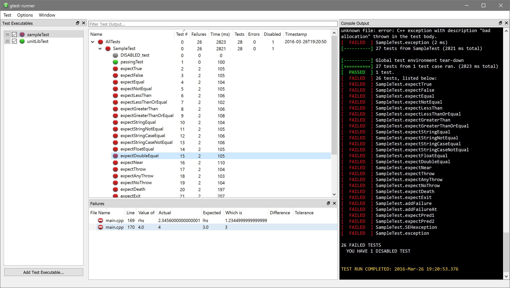

A Qt5 based automated test-runner and Graphical User Interface for Google Test unit tests

## Automatic test running

- Gtest-runner uses file system watchers do detect every time your test has changed (e.g. when you build it), and automatically re-runs the test and updates all the test case windows. This feature even works if you rebuild your test when gtest-runner is closed.
- Gtest-runner runs all of your tests in parallel, showing a progress indicator for each one.
- _Note:_ for expensive or lengthy tests, automatic test running can be disabled by unchecking the box next to the test name.

## Simple traffic-light output

-  - A green light means that the test was run and all test cases passed with no errors.
-  - A yellow light means that the test has changed on disc and needs to be re-run. If your test executable is corrupted, deadlocks, or segfaults, you may see a test in a "hung" yellow state.
-  - A red light means that the test executable failed at least one test case. 
-  - A gray light indicates that the test is disabled, _or_ if autorun is disabled it can also indicate that test output is out-of-date.

## Full console output

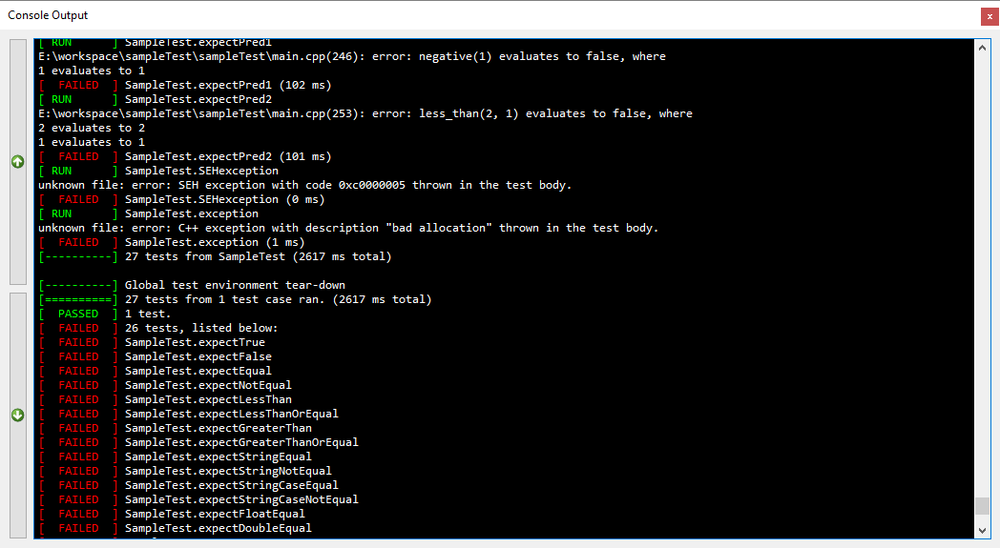

- All gtest console output is reatined (including syntax highlighting) and piped to the built-in console dock, so you get all the benefits of a GUI without losing any of your debugging output. Plus, `gtest-runner` adds additional capabilities like a [search dialog](#search-failures) and [forward and backward failure navigation buttons](#nextprevious-failure).

## Fully customizable layout

- Gtest-runner uses detachable docks for the test executable, failure, and conosle docks, so you can tab, rearrange, detach, or hide them to best suite your screen layout.

## Light and dark themes

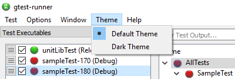 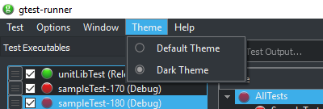

- Easily switch between your system's default color theme or a breeze-inspired dark theme.

## System notifications

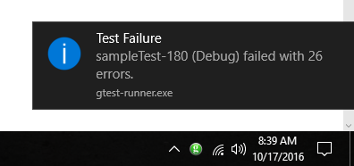

- When a test is autorun in the background, gtest-runner will generate a system notification letting you know if any tests failed. Notifications can also (optionally) be configured for tests which pass during autorun.
- _Note:_ notifications aren't generated for tests which are run manually (since you are presumably already looking at the output).

## Gtest support

- Gtest-runner supports both `gtest-1.7.0` and `gtest-1.8.0` style output.

# Test Executable dock

## Drag-and-drop

- To add a test executable to watch, simply drag-and-drop the test executable file anywhere on the `gtest-runner` GUI.

## Easily add and remove tests

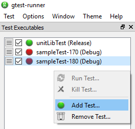

- In addition to drag-and-drop, it's easy to add or remove a test using the right-click context menu in the `Test Executable` window.

## Re-run test

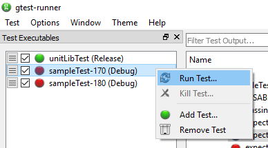

- You can manually re-run a test at any time by right-clicking on it and selecting `Run Test...`

## Kill test

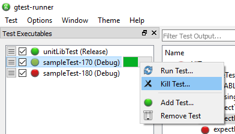

- Did you just actually click run on your 4-hour CPU intensive test? No problem! Cancel a test at any time by right-clicking on it, and selecting `Kill Test...`.
- _Hint:_ if the `Kill Test...` option is grayed out, that means your test isn't running (even if it has a yellow indicator).

## gtest command line options

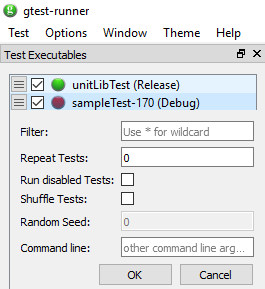

- Clicking on the hamburger menu to the left of the test executable name will pop up the `gtest command line` dialogue, allowing access to all of the options you'd have if you ran your test directly from a terminal.

## Enable/disable autorun

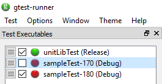

- Compiling frequently, or have a resource-intensive test that you don't want running in the background? Whatever the reason, it's simple to disable autorun by un-checking the autorun box next to the test executable name.

## Test progress

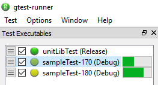

- Each running test displays a progress bar indicator. Measured progress is based on the number of tests completed out of the overall number of tests, not time-to-go.

## Test path tooltips

- Mousing over any of the test executables will show the full path to the test as a tooltip. This can be useful for disambiguating multiple tests with the same name. On Windows, `Debug` and `Release` builds are differentiated automatically.

# Test case window

## Detailed failure information

- Clicking on any failed test case will display detailed information about each `EXPECT/ASSERT` failure in the `Failures` window.
- _Note:_ No detailed information is available for test cases which pass or are disabled.

## Sort failures

## Filter failures

# Failure window

## Jump to console output

## Open in IDE

## Full GTest error message

# Console Window

## Search

## Next/previous failure

## Clear output from previous runs

## Cout

